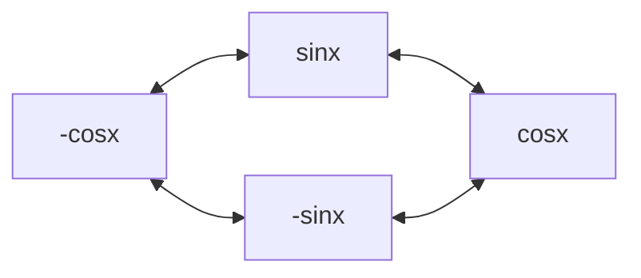

| Rule           | Derivative                                                         | Integral                                                                  |
| -------------- | ------------------------------------------------------------------ | ------------------------------------------------------------------------- |
| Constant       | $\begin{flalign}(a)'=0\end{flalign}$                               | $\begin{flalign}\int a\,dx=ax+C\end{flalign}$                             |
| Power          | $\begin{flalign}\frac{d}{dx}x^n=nx^{n-1}\end{flalign}$             | $\begin{flalign}\int x^n\,dx=\frac{x^{n+1}}{n+1}+C\end{flalign}$          |
| Addition       | $\begin{flalign}(u+v)'=u'+v'\end{flalign}$                         | $\begin{flalign}\int u+v\,dx=\int u\,dx+\int v\,dx+C\end{flalign}$        |
| Product        | $\begin{flalign}(u\cdot v)'=uv'+vu'\end{flalign}$                  | $\begin{flalign}\int uv\,dx=uv-\int v\frac{du}{dx}\,dx+C\end{flalign}$    |
| Quotient       | $\begin{flalign}(\frac{u}{v})'=\frac{vu'-uv'}{v^2}\end{flalign}$   | Use $v$ as $v^{-1}$ as product                                            |
| Exponent       | $\begin{flalign}\frac{d}{dx}a^x=a^x\ln a\end{flalign}$             | $\begin{flalign}\int a^x\,dx=\frac{a^x}{\ln a}+C\end{flalign}$            |
| Logarithm      | $\begin{flalign}\frac{d}{dx}\log_ax=\frac{1}{x\ln a}\end{flalign}$ | $\begin{flalign}\int \log_ax\,dx=x\log_ax-\frac{x}{\ln a}+C\end{flalign}$ |
| Natural Log    | $\begin{flalign}\frac{d}{dx}\ln x=\frac{1}{x}\end{flalign}$        | $\begin{flalign}\int \ln x\,dx=x\ln x-x+C\end{flalign}$                   |
| Euler's Number | $\begin{flalign}\frac{d}{dx}e^x=e^x\end{flalign}$                  | $\begin{flalign}\int e^x\,dx=e^x+C\end{flalign}$                          |
# Trigonometric Functions

|                                                         |                                                          |
| ------------------------------------------------------- | -------------------------------------------------------- |
| $\begin{flalign}\frac{d}{dx}sinx=cosx\end{flalign}$     | $\begin{flalign}\frac{d}{dx}cosx=-sinx\end{flalign}$     |
| $\begin{flalign}\frac{d}{dx}tanx=sec^2x\end{flalign}$   | $\begin{flalign}\frac{d}{dx}cotx=-csc^2x\end{flalign}$   |
| $\begin{flalign}\frac{d}{dx}secx=secxtanx\end{flalign}$ | $\begin{flalign}\frac{d}{dx}cscx=-cscxcotx\end{flalign}$ |

|                                                               |                                                                |
| ------------------------------------------------------------- | -------------------------------------------------------------- |
| $\begin{flalign}\int sinx\,dx=-cosx+C\end{flalign}$           | $\begin{flalign}\int cosx\,dx=sinx+C\end{flalign}$             |
| $\begin{flalign}\int tanx\,dx=-ln\|cosx\|+C\end{flalign}$     | $\begin{flalign}\int cotx\,dx=ln\|sinx\|+C\end{flalign}$       |
| $\begin{flalign}\int secx\,dx=ln\|secx+tanx\|+C\end{flalign}$ | $\begin{flalign}\int cscx\,dx=-ln\|cscx+cotx\|+C\end{flalign}$ |

|                                                                                 |                                                                                  |
| ------------------------------------------------------------------------------- | -------------------------------------------------------------------------------- |
| $\begin{flalign}\frac{d}{dx}sin^{-1}x=\frac{1}{\sqrt{1-x^2}}\end{flalign}$      | $\begin{flalign}\frac{d}{dx}cos^{-1}x=-\frac{1}{\sqrt{1-x^2}}\end{flalign}$      |
| $\begin{flalign}\frac{d}{dx}tan^{-1}x=\frac{1}{1+x^2}\end{flalign}$             | $\begin{flalign}\frac{d}{dx}cot^{-1}x=-\frac{1}{1+x^2}\end{flalign}$             |
| $\begin{flalign}\frac{d}{dx}sec^{-1}x=\frac{1}{\|x\|\sqrt{x^2-1}}\end{flalign}$ | $\begin{flalign}\frac{d}{dx}csc^{-1}x=-\frac{1}{\|x\|\sqrt{x^2-1}}\end{flalign}$ |

|                                                                                       |                                                                                       |
| ------------------------------------------------------------------------------------- | ------------------------------------------------------------------------------------- |
| $\begin{flalign}\int sin^{-1}x\,dx=xsin^{-1}x+\sqrt{1-x^2}+C\end{flalign}$            | $\begin{flalign}\int cos^{-1}x\,dx=xcos^{-1}x+\sqrt{1-x^2}+C\end{flalign}$            |
| $\begin{flalign}\int tan^{-1}x\,dx=xtan^{-1}x-\frac{1}{2}\ln\|1+x^2\|+C\end{flalign}$ | $\begin{flalign}\int cot^{-1}x\,dx=xcot^{-1}x-\frac{1}{2}\ln\|1+x^2\|+C\end{flalign}$ |
| $\begin{flalign}\int sec^{-1}x\,dx=xsec^{-1}x-\ln\|x+\sqrt{x^2-1}\|+C\end{flalign}$   | $\begin{flalign}\int csc^{-1}x\,dx=xcsc^{-1}x+\ln\|x+\sqrt{x^2-1}\|+C\end{flalign}$   |
## Recitation Techniques
derivative of a trigonometric co-function always is negative
### sin and cos
derivative = clockwise
integral = counterclockwise

### the rest
The derivative of the function is the product of the other cells in the row

|     |     |     |
| :---: | :---: | :---: |
| tan | sec | sec |
| cot | csc | csc |

The derivative of the co-function of a trigonometric functional inverse is always the negative of its direct function