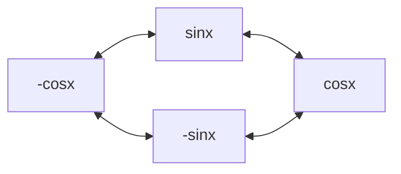

| Rule     | Derivative                                                       |
| -------- | ---------------------------------------------------------------- |
| Constant | $\begin{flalign}(C)'=0\end{flalign}$                             |
| Power    | $\begin{flalign}(x^n)'=nx^{n-1}\end{flalign}$                    |
| Inverse  | $\begin{flalign}(\frac{1}{x})'=-\frac{1}{x^2}\end{flalign}$      |
| Addition | $\begin{flalign}(f+g)'=f'+g'\end{flalign}$                       |
| Product  | $\begin{flalign}(f\cdot g)'=f'g+fg'\end{flalign}$                |
| Quotient | $\begin{flalign}(\frac{f}{g})'=\frac{gf'-fg'}{g^2}\end{flalign}$ |
# Trigonometric Functions

| Function                                              | Inverse                                                  |
| ----------------------------------------------------- | -------------------------------------------------------- |
| $\begin{flalign}\frac{dsinx}{dx}=cosx\end{flalign}$   | $\begin{flalign}\frac{dcscx}{dx}=-cscxcotx\end{flalign}$ |
| $\begin{flalign}\frac{dcosx}{dx}=-sinx\end{flalign}$  | $\begin{flalign}\frac{dsecx}{dx}=secxtanx\end{flalign}$  |
| $\begin{flalign}\frac{dtanx}{dx}=sec^2x\end{flalign}$ | $\begin{flalign}\frac{dcotx}{dx}=csc^2x\end{flalign}$    |
## Recitation Techniques
derivative of a trigonometric co-function always is negative
### sin and cos
derivative = clockwise
integral = counterclockwise

### the rest
derivative = the other cells in the row

|     |     |     |
| :---: | :---: | :---: |
| tan | sec | sec |
| cot | csc | csc |
