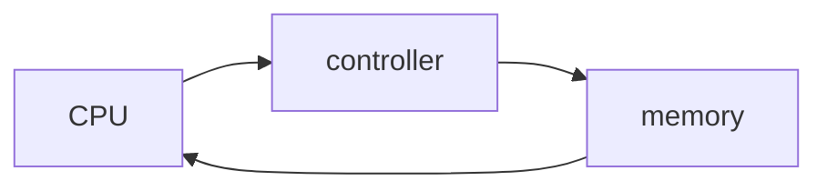

# Week 1
## 1. Introduction
Operating System (OS) is a software that manages resources and control everything within a computer system.

### Typology
Mobile OSes (iOS, Android, HarmonyOS, Tizen) vs Desktop OSes (MacOS, WindowsOS, Linux, ChromeOS)
Windows vs UNIX like
Mainframe OSes: z/OS, z/Vm, Linux for System Z
### Goals
- Run programs to solve users' problems
- Be user-friendly
- Make the most out of hardware
### Components
1. Memory Manager
2. Processor Manger (In this class, CPU only, no GPU)
3. Device Manager
4. File Manager
5. User Command Interface (CLI)
6. Network Manager
7. Security Manager

## 2. Boot Process
### 2.1 Power On: BIOS & UEFI
The processor runs the first program in ROM which are either
1. Basic Input/Output System (BIOS)
2. Unified Extensible Firmware Interface (UEFI)

|                     | BIOS                     | UEFI                                     |
| ------------------- | ------------------------ | ---------------------------------------- |
| Real Mode           | 16-bit                   | 32-bit/64-b                              |
| Interface           | Text Mode                | GUI                                      |
| Partitioning Scheme | Master Boot Record (MBR) | GUID Partition Table (GPT)               |
| Bootloader Location | First section            | EFI System Partition (ESP)               |
| Secure Boot         | No                       | Yes, verify the digital signature of the |
| Multibooting        | Complicated              | Simple                                   |
| Max Partitions      | 4                        | 128                                      |
| Max Partition Size  | 2 TB                     | 9.4 ZB                                   |

### 2.2 Power-On Self-Test (POST)
- Runs a series of tests to check hardware
### 2.3 Bootloader Selection
1. BIOS locates Master Boot Record (MBR) on the boot drive which contains
	information about the partitions and the bootloader
2. UEFI locates the EFI System Partition (ESP) from the GUID Partition Table (GPT), a dedicated partition that contains bootloaders, drivers, and related files required for system startup
	UEFI reads the Boot Configuration Data (BCD) store to determine the default bootloader
### 2.4 Bootloader Execution
1. BIOS loads and execute the bootloader from the MBR
2. UEFI loads and execute the selected bootloader from the ESP
### 2.5 Operating System Load
- The bootloader locates and loads the OS kernel
### 2.6 OS Initialization
- OS takes over and completes the boot process

## 3. Dual mode Operation
Mode Bit: 0 (Monitor/Kernel/System), 1 (User)
Privileged instructions can only be used in monitor mode.

In this class, only instructions directly related about I/O are privileged instructions.
Variable assignment, if-else, reading date, these are not privileged instructions.

OS try to minimize switching mode bit because the overhead slows the system down.

Memory Management Unit (MNU) checks if programs access their appropriate memory. And switch to monitor mode if there is something fishy going on.

## 4. Virtualization
- VMs and guest OS sit on a virtualization layer which sits on the host OS
- Multibooting uses one OS at a time, virtualization runs 2 OSes simultaneously, one on top of another
### Type 1: Hypervisor (bare-metal)
- Microsoft Hyper-V (WindowsOS)
### Type 2: Hypervisor (hosted)
- Oracle Virtual Box
- VMWare
- Parallel Desktop (MacOS)
## 5. Containerization
- Apps sit on the docker engine's containerization layer
### Terminologies
- Docker Engine: manages images, networks, and volumes
- Dockerfile: Text instruction on how to build a Docker image
- Docker Image: A read-only template to create Docker containers. It contains application code, runtime, libraries, and dependencies needed to run the app
- Docker Hub: A Docker images sharing platform
- Docker Container: A runnable instance of a Docker image
- Volume: A mechanism for persisting data generated and used by Docker containers
- Network: Networking features to connect containers to each other and to the outside world4
- Microservice: Docker app running on cloud (Out of the scope of this class)

| Factor       | Containerization                    | Virtualization              |
| ------------ | ----------------------------------- | --------------------------- |
| OS           | Same as host OS                     | Any OS                      |
| Machine      | Doesn't simulate the entire machine | Simulate the entire machine |
| Portability  | More portable                       | Less portable               |
| Weight       | Light                               | Heavy                       |
| Booting Time | Fast                                | Slow                        |

## 6. Docker

```bash
docker images
docker pull <image>
docker rm -i <image>
```
-i = image

```bash
docker create -p <host_port>:<container_port> -d --name <name> <image>
```
-p = port
-d = detach

```bash
docker ps -a
```
-a = all

```bash
docker start <name>
docker stop <name>
docker rm <name>
```

```bash
docker run -p <host_port>:<container_port> -d --name <name> <image>
```
create and start

```bash
curl localhost:8080
```
Outputs HTML

# Week 2
## 1. Interrupt

CPU -> controller -> memory -> CPU


- I/O devices and the CPU can execute concurrently
- Each device controller is in charge of a particular device type
- Device controller informs CPU that it has finished its operation by causing an interrupt
### Functions
- Interrupt architecture must save the address of the interrupted instruction
- Interrupt passes control to the **Interrupt Service Routine (ISR)** by utilizing **interrupt vector**, which stores the addresses of all the service routines
- A trap is an interrupt generated by software, triggered by either program error (exceptions) or request to the OS (through **system calls**)
## 2. OS Typology
### 2.1 Data Entry
1. Batch: Serial, no user interaction
	- Single-programmed Batch
	- Multi-programmed Batch: switches jobs while the current job is waiting for I/O
2. Interactive
	- Time sharing: Illusion of real time simultaneous execution by giving each task or user a small slice
	- A job goes back and forth between memory and disk
	- On-line system is needed for users to access data and code
3. Hybrid: Most modern OS
	- Batch applications are executed in the background during periods of low interactive workload
### 2.2 Number of Users and Task
1. Single-user single-tasking: very primitive
	- MS DOS
2. Single-user multi-tasking
	- Desktops: WindowsOS, MacOS 
3. Multi-user multi-tasking
	- Servers: Ubuntu Server
### 2.3 Special Purpose Systems
1. Real Time Systems
	- Hard Real Time: Secondary storage is limited/non-existent. Short-term memory or Read-only Memory (ROM). Not compatible with general-purpose OS. e.g. VxWorks, RTXC
	- Soft Real Time: Multimedia, virtual reality. Might be compatible with general-purpose OS, just put the task priority higher
2. Embedded Systems
	- Specialized, have specific functions, dedicated to specific tasks and often operate with limited resources
### 2.4 Architecture
1. Single Processor
2. Parallel Systems/Multiprocessors/Tightly-coupled: Shared resources
3. Distributed Systems/Loosely-coupled: A collection of independent computers, each node has its own resources, requires networking infrastructure
	- Network Operating Systems: Access performed by a local OS
		- Windows Server, Ubuntu Server, (Windows 11, MacOS?)
	- Distributed Operating Systems: Access performed by the DO/S
		- Sprite, Amoeba

## 3. System Call
### OS Services
1. User Interface (UI): CLI, GUI
2. Program execution
3. I/O Operations
4. File-system manipulation
5. Communications: shared memory, message passing
6. Error Detection
7. Resource Allocation
8. Accounting
9. Protection and Security: Protection regulates, security authorizes
### User Operating System Interface
1. Command Line Interface (CLI)
	- Implemented in kernel: faster but needs to compile kernel with every change
	- Implemented as external program: slower
		- Commands built-in, increases the CLI size, and needs recompiling: cd, echo, pwd
		- names of programs: ls, cp, grep

### System Calls
Application Programming Interface (API) that allows access to the functions and services offered by the OS
- Typically written in a high-level language (C or C++)
- Typically, programs primarily employ high-level API instead of relying on OS system calls
1. Win32 API for Windows
2. POSIX API for POSIX-based systems (UNIX, Linux, and MacOS)
3. Java API for Java Virtual Machine (JVM)
User program calls a library function -> Library makes a system call -> Trap into kernel mode -> Kernel executes the request -> Returns to user mode

## 4. Kernel Architecture
1. Monolithic Architecture: All OS services run together in kernel mode. Faster but bigger and more complicated kernel, harder to maintain.
	- Linux
2. Microkernel Architecture: Only most essential functions run in kernel mode, everything else runs in user space. Slower but easier to maintain
	- Mach OS 
3. Hybrid Architecture: WindowsOS, MacOS