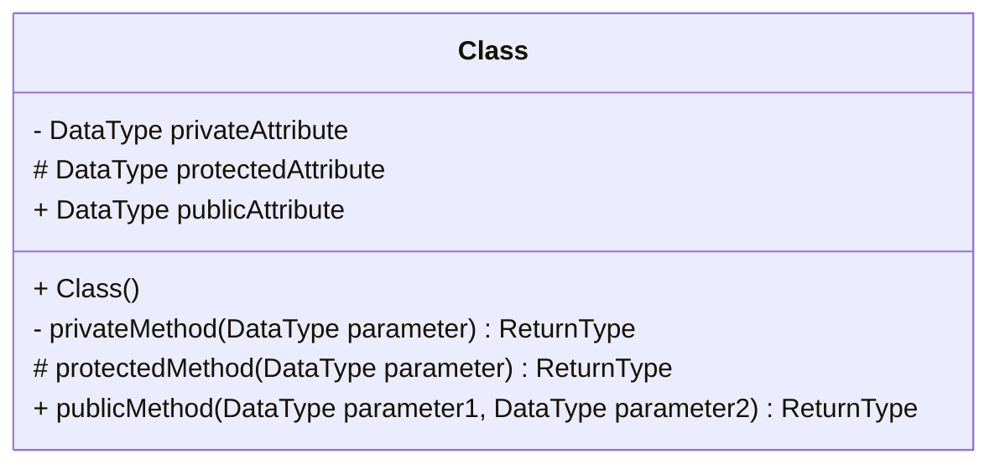

```mermaid
classDiagram
    class Class {
        - DataType privateAttribute
        # DataType protectedAttribute
        + DataType publicAttribute
        + Class()
        - privateMethod(DataType parameter) ReturnType
        # protectedMethod(DataType parameter) ReturnType
        + publicMethod(DataType parameter1, DataType parameter2) ReturnType
    }
```
Example